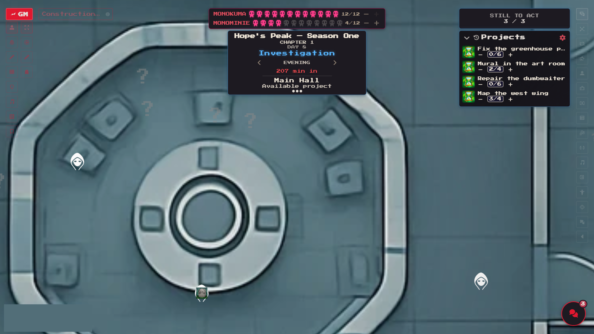
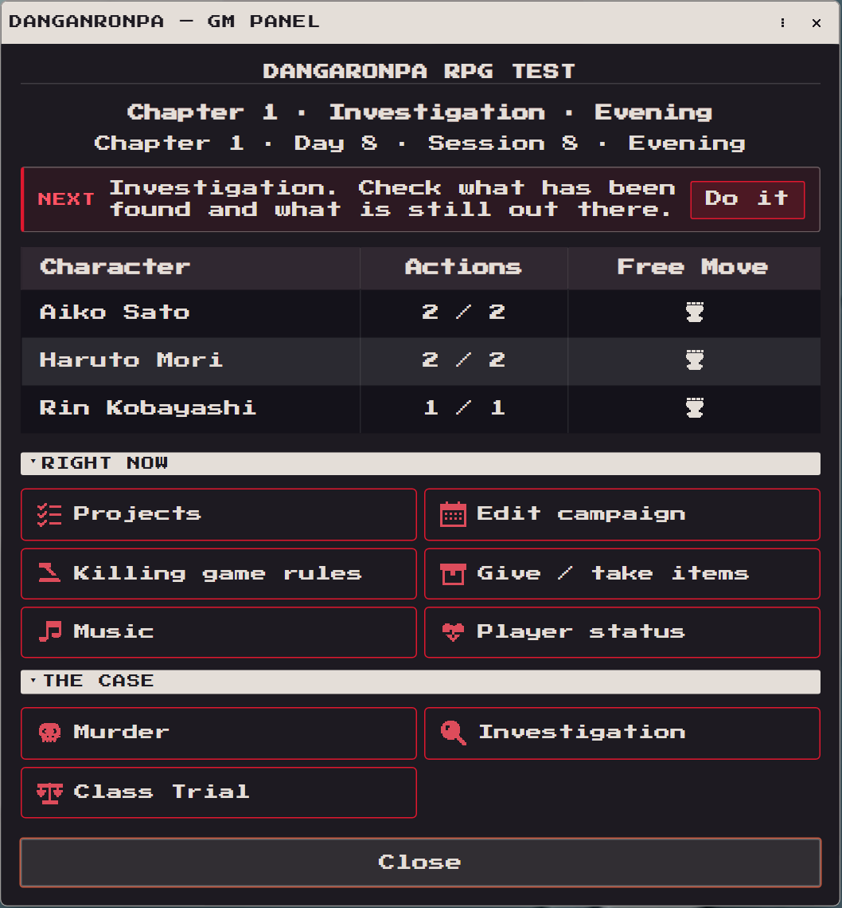
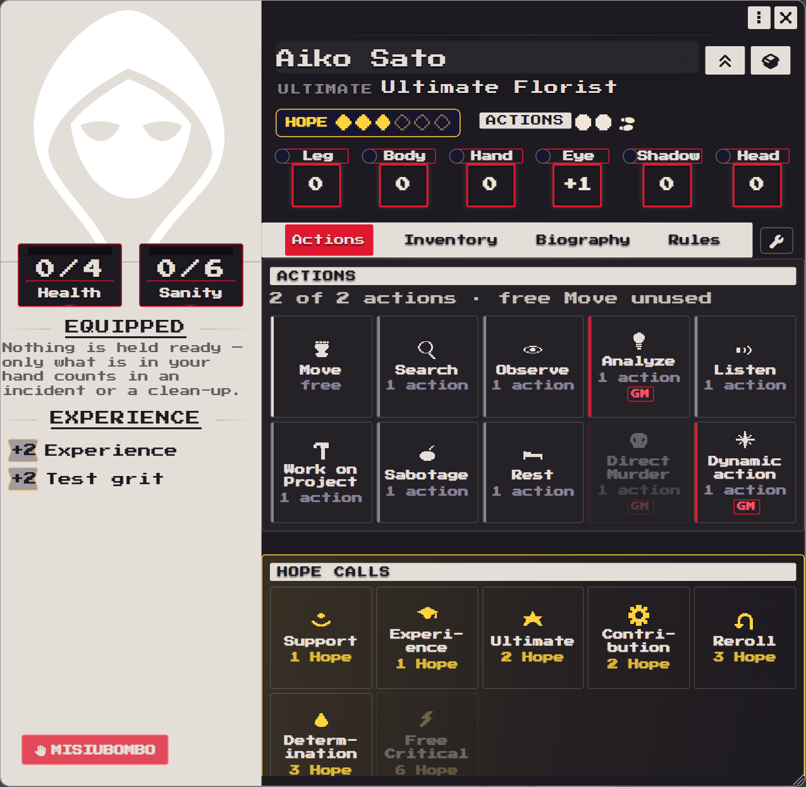
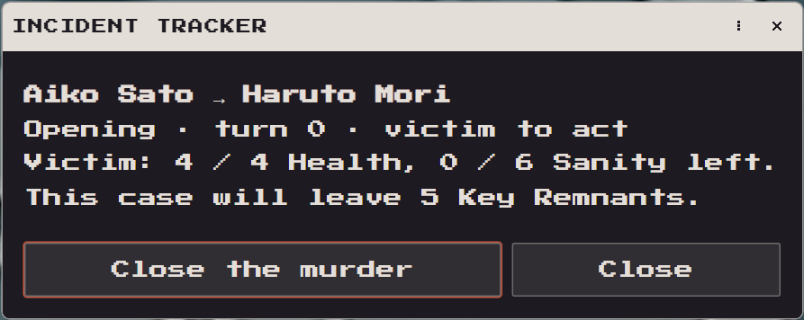
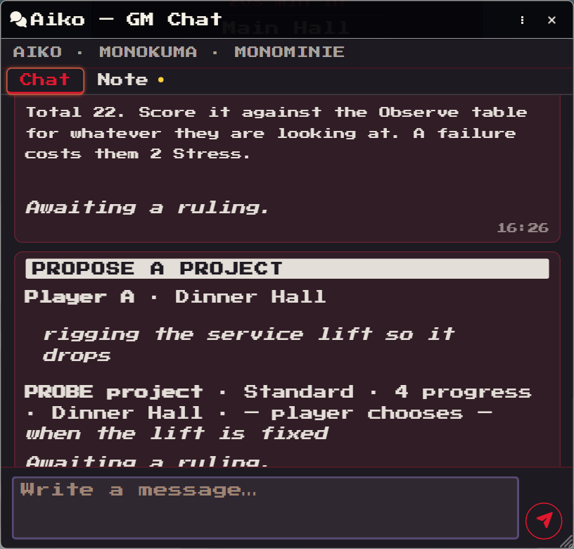
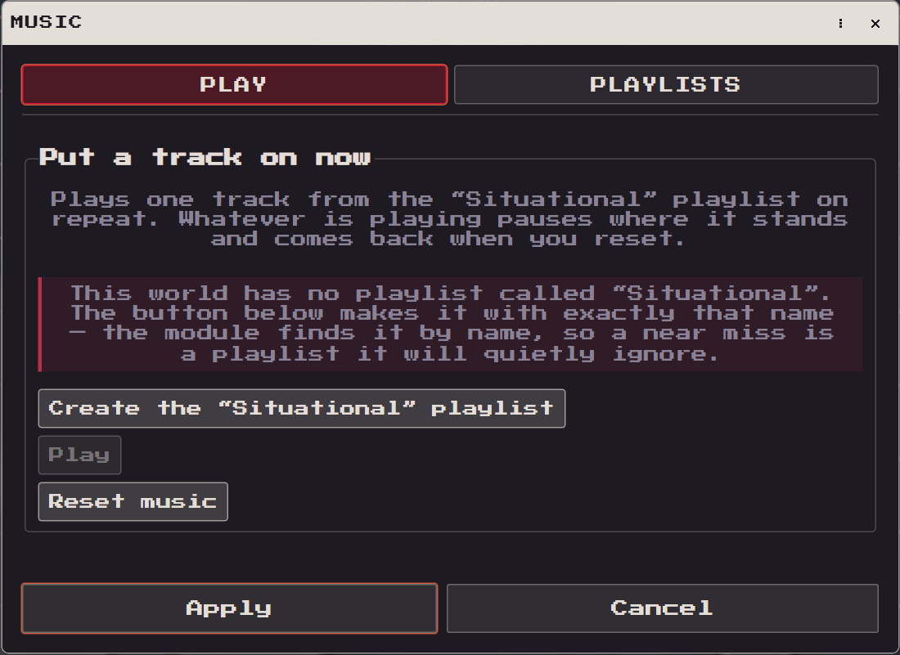

# Danganronpa RPG

*A killing game for Foundry VTT, built on Daggerheart.*


[](https://github.com/Akrobacjum/Danganronpa-RPG/releases/latest)
[](LICENSE)



## What is this?

This module turns the [Daggerheart](https://foundryvtt.com/packages/daggerheart)
system into a full **Danganronpa tabletop experience**: a class of Ultimate
students locked in together, a daily rhythm of life and suspicion, and — sooner
or later — a body, an investigation, and a class trial.

Mechanically it is Daggerheart wearing a very different outfit: traits are
renamed (Leg, Body, Hand, Eye, Shadow, Head), Fear becomes **Despair** and
fuels the Monokuma side of the table, rolls the killer makes are forced
private, and the day runs on a **time-of-day action economy** instead of
combat rounds. On top of that sit systems Daggerheart never had: per-room
search tokens, **Remnants** appearing on the map that become **Truth Bullets**
in an investigator's inventory, a murder engine with openings, crisis actions
and clean-ups, and a timed, speaker-by-speaker **class trial**.

## Features

**The day** — a season clock with chapters, days and times of day; every
student gets a budget of actions (Search, Observe, Analyze, Listen, Work on
Project, Sabotage, Rest…) and one free Move per time of day. The GM panel
shows at a glance who still has something left to do.



**The school** — rooms are discovered by walking into them; undiscovered ones
sit under fog and reveal themselves in diagonal bands. Movement, voice chat
and what you can see all follow the room you are standing in.

**The students** — character sheets carry the renamed traits, Hope as a
spendable resource with **Hope Calls** (Support, Experience, Ultimate,
Contribution, Reroll, Determination…), Sanity, and a safeword button that can
stop any scene, no questions asked.



**The murders** — a killer declares an opening against a victim, the engine
walks both sides through opening rolls, crisis actions, betrayal, third
parties walking in, covering it up and moving the body. Deaths by one's own
hand are supported too — this is Danganronpa, after all. Every case leaves
**Key Remnants** on the map for investigators to find.



**The investigation** — Remnants observed on the map become Truth Bullets;
autopsies, secrets, shared evidence and an investigation dashboard keep the
case moving until the trial.

**The trial** — a trial floor with a speaking queue, timed floors, objections,
rebuttals, and a vote at the end. Present the right Truth Bullet at the right
moment.

**The messenger** — players text the GM in-game; rulings, project proposals
and answers all live in one thread per player.



**The music** — one window plays situational cues and maps playlists to the
phases of the day; it will even create its playlist for you.



**The GM's side** — a season setup checklist that says what is missing
before day one, per-room vaults and search tables, Monokuma despair pools,
a Mastermind with a lair, the Eclipse, a season reset that returns the world
to a clean day one, and a built-in regression suite (`game.drpg.runTests()`).

<!-- GIF ideas, to be recorded at a real table:
     window entrances and the time-of-day slide (motion layer),
     a fog reveal in diagonal bands,
     a Dice So Nice duality roll landing,
     presenting a Truth Bullet during a trial. -->

## Installation

The module is developed and played on **[The Forge](https://forge-vtt.com/)**,
and works the same on any Foundry VTT v14 host.

1. In Foundry's **Add-on Modules** tab choose **Install Module** and paste
   this manifest URL:

   ```
   https://github.com/Akrobacjum/Danganronpa-RPG/releases/latest/download/module.json
   ```

2. Install the **Daggerheart** system (2.6.0 or newer) and the dependencies
   below the same way, from their own package pages.

### Requirements

| | Version |
|---|---|
| Foundry VTT | 14.364+ (verified on 14.365) |
| [Daggerheart (Foundryborne)](https://foundryvtt.com/packages/daggerheart) | 2.6.0+ (verified on 2.6.5) |

### Dependencies

| Module | Why |
|---|---|
| [Dice So Nice!](https://foundryvtt.com/packages/dice-so-nice) | The duality dice you actually see roll |
| [Isometric Perspective](https://foundryvtt.com/packages/isometric-perspective) | The school is drawn isometrically |
| [LiveKit AVClient](https://foundryvtt.com/packages/avclient-livekit) | Per-room voice chat and eavesdropping |
| [libWrapper](https://foundryvtt.com/packages/lib-wrapper) | Required by Isometric Perspective |

## First-time setup

1. Create a world on the **Daggerheart** system and enable the module plus
   the dependencies above.
2. Open the **GM panel** and run **Season setup**. The checklist walks you
   through everything a season needs — Monokuma assignments, despair pools,
   vault and rest rooms, item tables, scene preparation — and tells you
   exactly what is still missing. A dash means a step is optional.
3. Have each player pick their student; the module initialises sheets with
   the right maxima and Hope.
4. Advance the clock to morning of day one, and let them settle in.
   Somebody will do something terrible soon enough.

## Credits

Designed, directed and play-tested by **Dawid (Akrobacjum)**.

Built in pair with **Claude Code**, Anthropic's AI coding agent, which wrote
much of the code and copy under Dawid's direction. The AI contribution comes
with **no copyright claim and no financial interest of any kind** — this
module is and will remain completely **free, for everyone**. See
[LICENSE](LICENSE): the whole module is dedicated to the public domain
under CC0.

## Fan-work disclaimer

Danganronpa is © Spike Chunsoft Co., Ltd. This is an unofficial,
non-commercial fan project, not affiliated with, endorsed by or connected to
Spike Chunsoft in any way. It contains no assets from the games.

Daggerheart is a game by Darrington Press. This module contains no
Daggerheart content — it requires the separately installed Daggerheart
system and only re-skins and extends it. Not affiliated with Darrington
Press.
