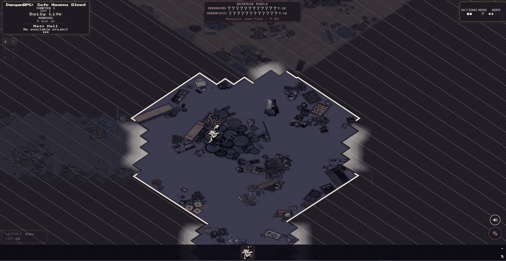
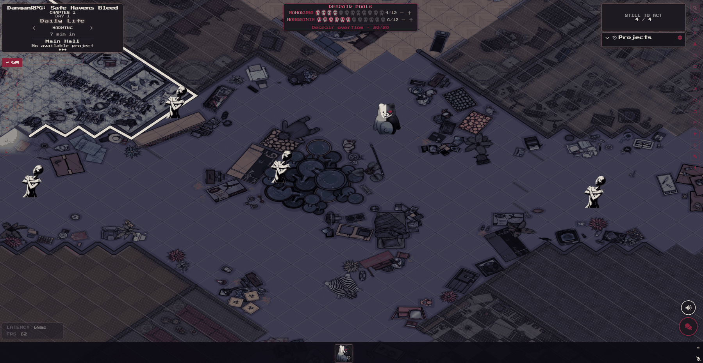
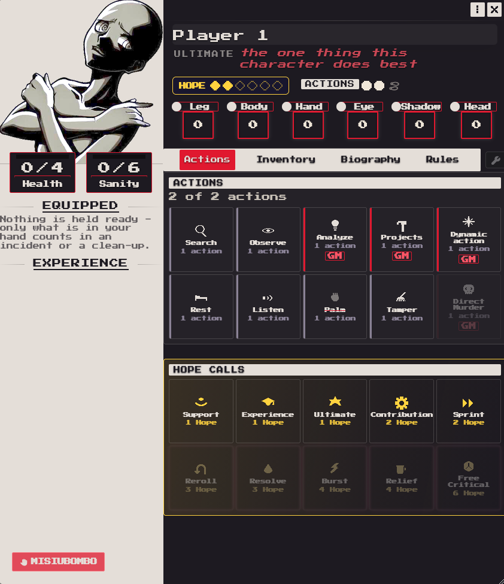
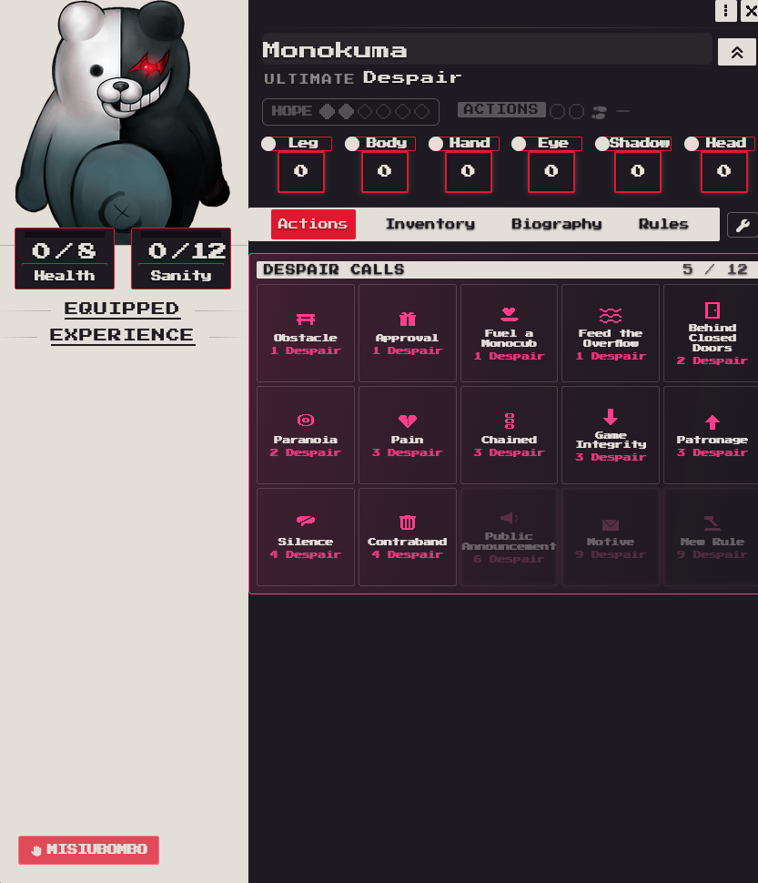
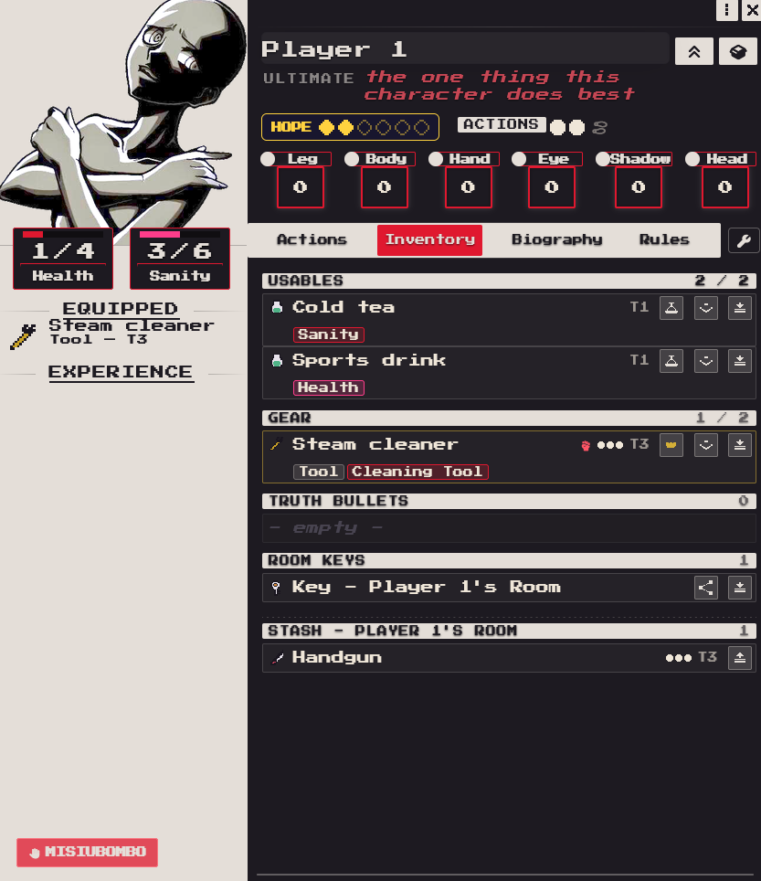
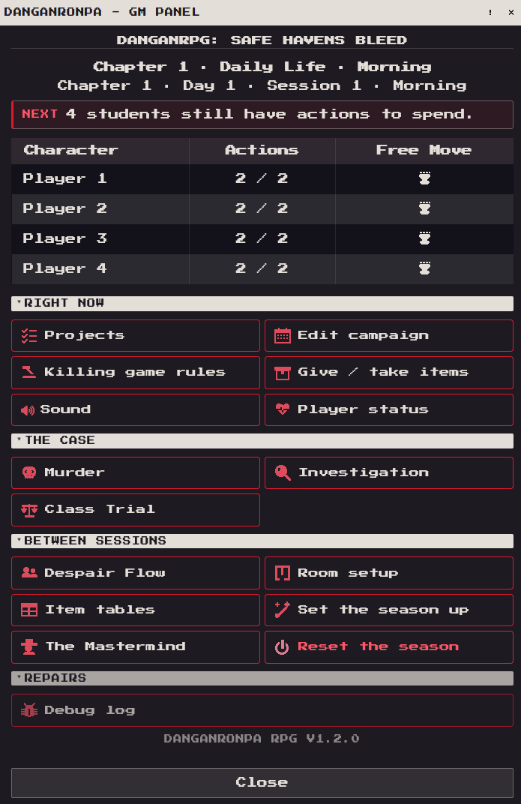

# Danganronpa RPG

*A killing game for Foundry VTT, built on Daggerheart.*


[](https://github.com/Akrobacjum/Danganronpa-RPG/releases/latest)
[](LICENSE)



## What this is

A class of Ultimate students is locked inside a school and told there is one
way out: kill somebody and get away with it. Then everyone goes to breakfast
and tries not to think about it.

This module turns [Daggerheart](https://foundryvtt.com/packages/daggerheart)
into that game. The traits are renamed - Leg, Body, Hand, Eye, Shadow, Head.
Fear becomes **Despair**, and it belongs to Monokuma. A day is measured in
times of day and a budget of actions instead of combat rounds. Underneath sits
everything Daggerheart never had a reason to build: rooms you have to walk into
before you can see them, a murder engine, an investigation that turns things
left on the floor into evidence in somebody's inventory, and a class trial that
ends in a vote.

## The same room, two screens

Above is a student's view. Below is the GM's - same minute, same hall.



The student sees the room they are standing in and a school that has not been
discovered yet. The Despair pools are on screen, but the numbers are `?`. The
GM sees the floor, the counters - `4/12`, `6/12`, an overflow sitting at
`30/20` - and who still has actions left to spend.

Almost everything in the module lives in that gap. Rooms are found by walking
into them and open up in diagonal bands. Voice follows you: the people in your
room are the people who can hear you, and someone in the next one may be
listening at the door.

## The students



Each time of day a student gets two actions and one free move, and spending
them is the whole of daily life. **Search** a room for what it is hiding,
**Observe** something, **Analyze** what you observed, put work into a
**Project**, **Listen** at a door, **Palm** something off a table, **Tamper**
with it - or describe something the game has no name for and let the GM set a
threshold for it.

Hope is spent from the same sheet. Ten **Hope Calls** buy advantage, an
Ultimate, a reroll, a burst of speed, a free critical; the expensive ones cost
most of what a careful student saves in a chapter.

The sheet also carries a **safeword button**. Anyone can press it at any time,
the scene stops, and nobody is owed an explanation.

## The other side of the table



Every point of Fear a Daggerheart GM would bank becomes Despair in a Monokuma's
pool, and it buys things: an obstacle, pain, paranoia, a sealed room, a silenced
student, a confiscated item, an announcement over the intercom - and at nine, a
**Motive** or a **New Rule**, which is how a season turns.

A pool holds twelve. Despair earned past that used to evaporate; it collects in
a shared **overflow** counter instead, and when the counter fills, one thing is
drawn at random out of eight - darker Eclipses, fewer search tokens, fewer
actions, no Hope, no Hope Calls, no free move, worn equipment, projects set
back. It lasts one time of day. A Monokuma can also pour Despair in on purpose,
just to see what comes out.

## What you are carrying



Hands are small - two usables, two pieces of gear. Everything else lives in the
stash in your room, which has a key, and a key can be handed to somebody. Gear
wears down: Despair on a roll takes a point of durability off whatever tool was
used.

**Truth Bullets** sit in the same inventory. They are not handed out by the GM.
They are what an investigator got out of a Remnant found on the map, and they
are the only thing you can fire in a trial.

## The murder, the case, the trial

A killer declares an opening against a victim, and the engine runs the rest of
the night: the opening roll, the crisis actions the victim can still reach for,
an accomplice who walks in and turns on the killer, a third party arriving at
the worst possible moment, the cover-up, moving the body. Deaths by one's own
hand are supported too - this is Danganronpa. Whatever happens leaves
**Remnants** behind on the map.

Investigators find them, observe them, analyze them, and a case dashboard keeps
what the table has worked out - autopsies, secrets, shared evidence. Then the
trial: a speaking queue, timed floors, objections that each take their own
track, rebuttals, and a vote. Present the right Truth Bullet at the right
moment.

## The GM's panel



One window, and behind it everything that needs a person: a season setup
checklist that says what is still missing before day one, per-room item tables
and vaults, the Mastermind and their lair, the Eclipse, the flow of Despair,
and a season reset that puts the world back to a clean day one. The messenger
is here too - players text the GM in-game, and rulings, project proposals and
answers all live in one thread each.

So is Sound: one window that maps playlists onto the phases of the day, and
will build its own "Situational" playlist if you have not made one.

## Installation

In Foundry's **Add-on Modules** tab choose **Install Module** and paste this
manifest URL:

```
https://github.com/Akrobacjum/Danganronpa-RPG/releases/latest/download/module.json
```

Then install the Daggerheart system and the modules below the same way, from
their own package pages. The module refuses to start without them and says
which one is missing.

| Needs | Version |
|---|---|
| Foundry VTT | 14.364+ (verified on 14.365) |
| [Daggerheart (Foundryborne)](https://foundryvtt.com/packages/daggerheart) | 2.6.0+ (verified on 2.6.5) |

| Module | Why |
|---|---|
| [Dice So Nice!](https://foundryvtt.com/packages/dice-so-nice) | The duality dice you actually watch roll |
| [Isometric Perspective](https://foundryvtt.com/packages/isometric-perspective) | The school is drawn isometrically |
| [LiveKit AVClient](https://foundryvtt.com/packages/avclient-livekit) | Per-room voice, and eavesdropping |
| [libWrapper](https://foundryvtt.com/packages/lib-wrapper) | Required by Isometric Perspective |

Developed and played on [The Forge](https://forge-vtt.com/); it works the same
on any Foundry v14 host.

## Starting a season

1. Make a world on the **Daggerheart** system and enable the module and its
   dependencies.
2. Open the GM panel and run **Set the season up**. The checklist walks through
   what a season needs - Monokuma assignments, despair pools, vault and rest
   rooms, item tables, scene preparation - and tells you exactly what is still
   missing. A dash means the step is optional.
3. Let each player pick their student. Sheets are initialised with the right
   maxima and starting Hope.
4. Move the clock to morning of day one and let them settle in. Somebody will
   do something terrible soon enough.

## Credits

Designed, directed and play-tested by **Akrobacjum**.

Built in pair with **Claude Code**, Anthropic's AI coding agent, which wrote
much of the code and copy under Akrobacjum's direction. The AI contribution
carries **no copyright claim and no financial interest of any kind** - this
module is and will remain **free, for everyone**. See [LICENSE](LICENSE): the
whole thing is dedicated to the public domain under CC0.

## Fan-work disclaimer

Danganronpa is © Spike Chunsoft Co., Ltd. This is an unofficial,
non-commercial fan project, not affiliated with, endorsed by or connected to
Spike Chunsoft in any way. It contains no assets from the games.

Daggerheart is a game by Darrington Press. This module contains no Daggerheart
content - it requires the separately installed Daggerheart system and only
re-skins and extends it. Not affiliated with Darrington Press.
