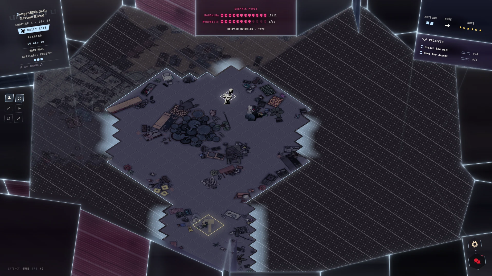
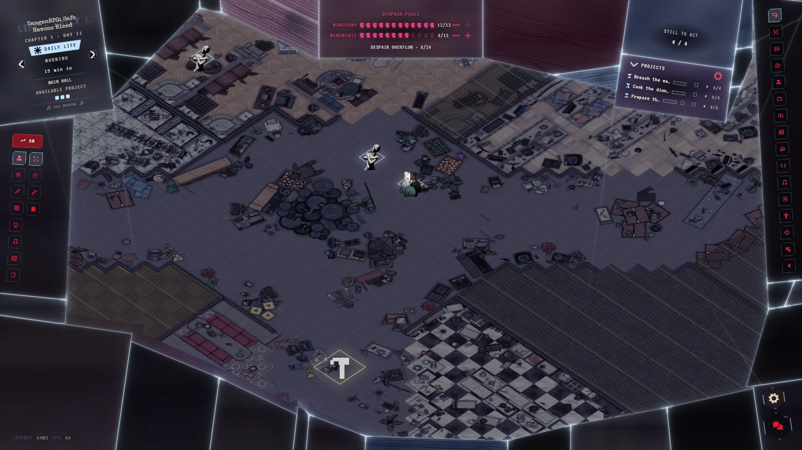
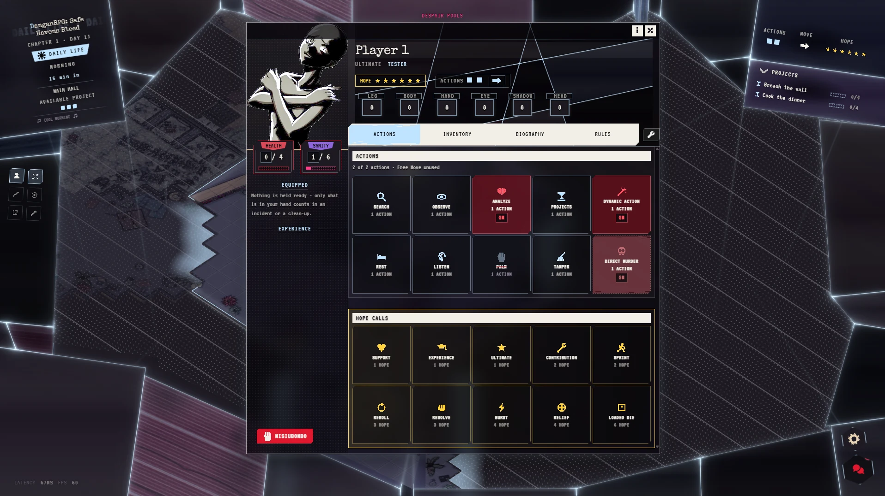
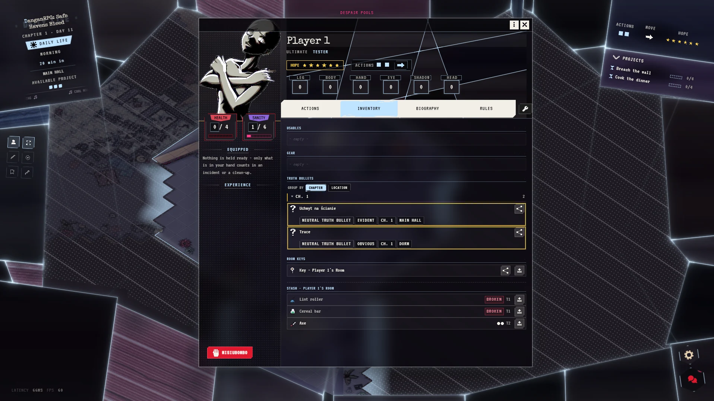
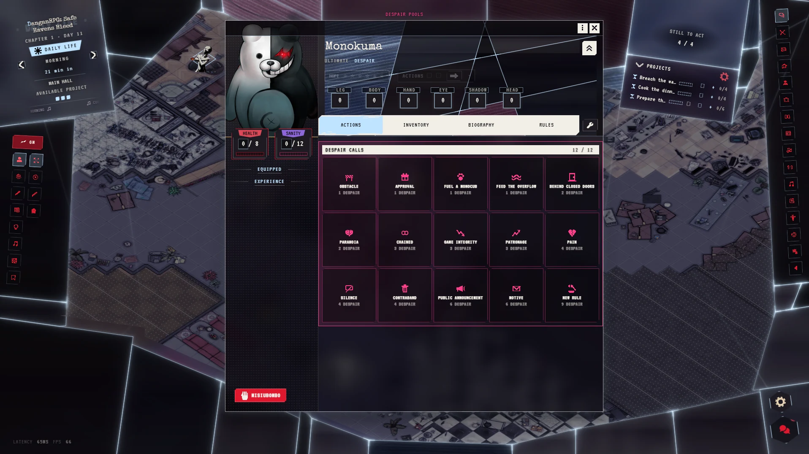
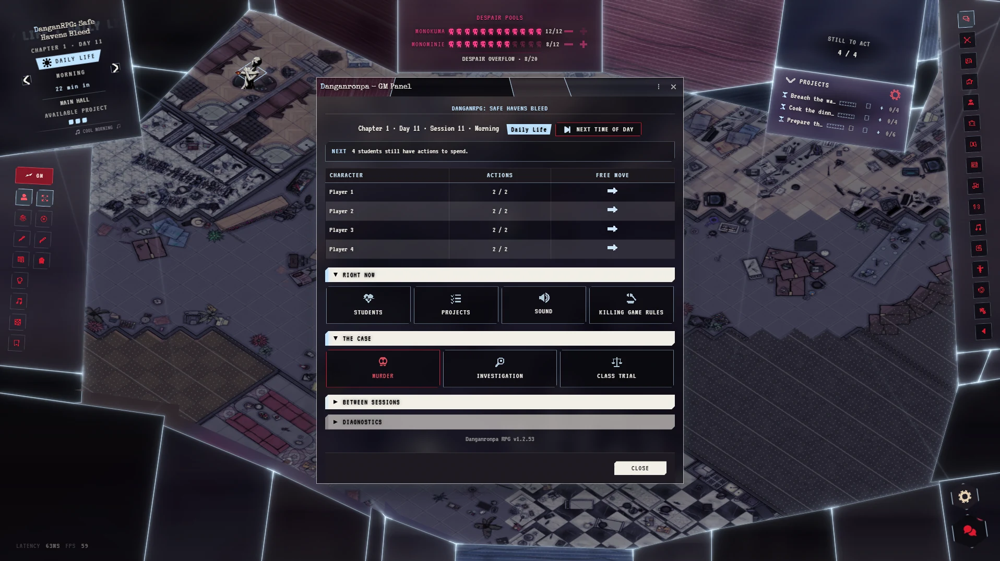

# Danganronpa RPG

*A killing game for Foundry VTT, built on Daggerheart.*


[](https://github.com/Akrobacjum/Danganronpa-RPG/releases/latest)
[](LICENSE)

A class of Ultimate students wakes up locked inside a school. Monokuma explains
the only way out: kill a classmate and get away with it. Then everyone goes to
breakfast and tries not to think about it.

This module reworks the [Daggerheart](https://foundryvtt.com/packages/daggerheart)
system into that game, and runs the whole loop for you: school days spent on a
small budget of actions, a murder played out turn by turn, an investigation
where the traces left behind become evidence, and a Class Trial that ends in a
secret vote. Players see only the room their student is standing in.

It is made for a long campaign with a group of players and two GMs who share
the part of Monokuma, though one GM can run it alone. A session usually covers
one school day, each chapter builds to a murder and ends in its trial, and a
season runs six chapters.



## At a glance

- **Rooms you have to walk into.** Fog covers every room you have not been in
  yet, rooms you have left stay veiled, and you only see the people standing in
  the same room as you.
- **Two actions per time of day.** Search, observe, analyse, work on a project,
  listen at a door, pick a pocket. Two is never enough, and that is the point.
- **Lights out between times of day.** During the Eclipse nobody sees anybody,
  everyone moves in secret, and it is the only time a murder can be declared.
- **Monokuma plays against you.** Every roll that comes up Despair gives
  Monokuma a point to spend on obstacles, pain, motives and new rules.
- **Evidence has to be found.** Murders, clean-ups and suspicious searches
  leave traces on the map. Whoever finds one gets a Truth Bullet to argue with
  in the trial.
- **Safety built in.** A safeword on every sheet stops the game, and nobody has
  to say why.

## A day at the school

A day has five times of day: Morning, Noon, Afternoon, Evening and Night. Each
one gives every student **two actions and one Free Move**. Walking around inside
the room you are in is free. The first crossing into a connected room uses your
Free Move, and every crossing after that costs an action. Locked doors, sealed
rooms and other people's bedrooms turn you back, unless you hold a copy of the
key.



The two screenshots above were taken a minute apart. The student sees the Main
Hall and a school still under fog. The GM sees the whole floor, how many
students still have actions left, and the Despair overflow count that players
only see as `?`.

With LiveKit installed and regional voice switched on, voice follows the rooms
too: you hear the people in your room, and one voice call for the whole school
turns into a lot of small conversations.

Before each time of day comes the **Eclipse**. The lights go out, nobody sees
anybody else, and every student quietly places their token up to two rooms away,
or anywhere at all before Night. With regional voice on, everyone is alone on a
channel of their own until the lights come back.

## The students



The sheet is where daily life happens. There are ten actions. You can **Search**
a room for something useful, **Observe** it for traces, **Analyze** what you
picked up, put work into a **Project** or **Rest**. You can also **Listen** at
the door of the next room, **Palm** something out of somebody's pocket or into
it, **Tamper** with evidence, try a **Dynamic** action the GM rules on, or
declare a **Direct Murder**. The traits are Daggerheart's six, renamed Leg,
Body, Hand, Eye, Shadow and Head.

**Hope** buys the ten **Hope Calls**, from helping a friend for 1 Hope to
setting one die to 12 for 6, with rerolls, a free next action and a sprint
through one extra door in between. Health and **Sanity** are the two ways to be
worn down: run out of Sanity and you break down, run out of Health and you are
wounded.

A **project** is anything that takes more than one action: breaching a wall,
cooking a dinner, building a trap. Proposing one costs nothing. Once the GM
approves it, it appears in the Projects tray, and as a hammer on the map if it
belongs to a room, and students put actions into it until it is done. A secret
project is seen only by the people in on it, and a sabotaged one stays frozen
until somebody repairs it.

Every sheet also has a **safeword** button. Anyone can press it at any time. The
game pauses, everyone sees that the scene has stopped, and only the GMs learn
who pressed it. Before a session each player can also leave the GMs a note in
the messenger, using a short template about their plans, their limits and their
triggers.

## What you carry



Pockets are small: three usables and two slots for gear, and of the gear only
the piece you hold ready does anything. A tool wears down when a roll that uses
it comes up Despair. The stash in your bedroom holds three more things. The
bedroom has a key, and a key can be copied for someone you trust. An open stash
can be rifled by anyone who walks in.

**Truth Bullets** live in the same inventory. Most of them you find yourself, by
observing a trace on the map, and a new one usually stays neutral until you
analyse it. The GM hands out the autopsy, and a classmate can share a copy of
theirs.

## Monokuma's side



Every time a student's roll lands with the Despair die higher, a point of
Despair goes to that student's Monokuma. A pool holds twelve. Monokuma spends
it on **Despair Calls**: an obstacle, paranoia, a sealed room, a silenced
student, a destroyed item, an announcement that calls everyone to one place,
and at the top end a **Motive** with a deadline and a **New Rule** for the
killing game.

Despair earned past a full pool is not lost. It collects in a shared
**overflow**, and when the overflow fills, one bad thing is drawn at random:
fewer actions, no Free Move or no Hope for a time of day, darker Eclipses, worn
tools, projects set back.

With two GMs, each plays a Monokuma with a pool of their own and half of the
students feeding it. One GM can hold both halves.

A season can also have a **Mastermind**: one student, agreed on with their
player before the season starts, who is secretly behind the whole killing game.
Only the GMs and that player know who it is. Locked doors do not stop them, and
from their lair they can see everyone on the map. The season ends with a Final
Trial in which the class tries to name them.

A player whose student dies does not have to sit out. The GM can invite them
over to Monokuma's side as a **Monocub**. They keep walking the school and can
spend Hope that Monokuma gives them on Confusion, which quietly helps or spoils
the next roll of a student in the same room.

## The murder, the investigation, the trial

A killer declares a murder during the Eclipse. If exactly one other character is
in their room when the lights come up, and the GM approves, that character
becomes the victim. The fight is played out in turns. The victim can leave a
clue, fight back or try to survive, while the killer strikes or pins them down,
and each time the turn comes back to the victim they lose Sanity, then Health.
Someone walking in on it gets one choice: flee with the victim, join the killer,
turn on the killer, or look away. A trap built as a project can kill as well,
and so can a death by one's own hand.

Afterwards the killer can clean up: erase traces, rewrite what a trace says,
plant one that points at a classmate, or move the body. A clumsy attempt leaves
a trace of its own. The body is discovered the moment two students walk in on
it.

During the **Investigation** the students observe and analyse what was left,
and the GM plans the key clues on a case dashboard. If the class finds fewer
than four of them, every Monokuma gets 3 Despair for each one short of four.

Then comes the **Class Trial**. Students present Truth Bullets from their
inventory. In the Nonstop Debate, presenting one becomes an **Objection**: you
name who you are contradicting and hold the floor alone for one minute, then
the two of you get a two-minute **Rebuttal**. Every screen shows who has the
floor, but nobody is muted, so the table keeps the silence itself. It ends in a
secret vote. If the class names the killer, the killer is executed and the
survivors level up. If they get it wrong, the accused dies, the killer stays
among them stronger than before, and Monokuma's pools fill to the top.

## Running the game



Everything a GM needs is behind one panel. At the top it shows the clock, a
**Next** line that says what should happen now (often with a button to do it),
and who still has actions to spend. Below that:

- **Right now:** who is alive, dead or a Monocub, the projects, the sound, and
  the killing game rules.
- **The case:** the murder tracker, the investigation dashboard where the key
  clues are planned, and the Class Trial console.
- **Between sessions:** a season setup checklist that tells you what is still
  missing before day one, room setup (bedrooms, doors, where searching and
  resting work, stashes, room descriptions, the fog), item tables with twenty
  ready-made tables of ordinary school objects, the Despair pools and the
  overflow, the Mastermind, the end of a chapter and a full season reset.

**Sound** maps your playlists onto the time of day, the Eclipse and the trial,
and gives every game event a slot for a sound effect. The module ships no audio
of its own, and the music only starts following the game once a GM switches on
*Music follows the game state* in the module settings.

Players talk to the GMs through an in-game **messenger**. Anything that needs a
human ruling, like a dynamic action, a hint or a project proposal, arrives there
as a card with the buttons to answer it.

## The rules

The full rules come in three handbooks, in English and Polish: a GM Handbook, a
Player Handbook and a one-page Student Brochure for the table. They ship with
the module. The small book button in the bottom-right corner opens them in the
game, in the language you picked for the module, and only GMs see the GM
Handbook. You can also read them here, in [docs/handbooks](docs/handbooks).
They describe version 1.2.57. If a later version and a handbook ever disagree,
trust the module.

## Installation

In Foundry's **Add-on Modules** tab choose **Install Module** and paste this
manifest URL:

```
https://github.com/Akrobacjum/Danganronpa-RPG/releases/latest/download/module.json
```

Install the Daggerheart system and the modules below from their own package
pages. Without Dice So Nice the module does not start and tells the GM what is
missing. The two recommended modules are optional: if one is missing, the GM
gets a warning that can be switched off, and the rest of the module works
without it.

| Needs | Version |
|---|---|
| Foundry VTT | 14.364 or newer (verified on 14.365) |
| [Daggerheart (Foundryborne)](https://foundryvtt.com/packages/daggerheart) | 2.6.5 or newer (verified on 2.6.5; a newer version loads, and the GM is told once per version that it has not been measured) |

| Module | What it is for | |
|---|---|---|
| [Dice So Nice!](https://foundryvtt.com/packages/dice-so-nice) | The 3D duality dice | required |
| [Isometric Perspective](https://foundryvtt.com/packages/isometric-perspective) | Isometric maps, which is how the game is played | recommended |
| [LiveKit AVClient](https://foundryvtt.com/packages/avclient-livekit) | Voice that follows the rooms | recommended |

The module is developed and played on [The Forge](https://forge-vtt.com/).

## Starting a season

1. Create a world on the Daggerheart system and enable the module.
2. Bring your own school. The module ships no maps: draw the map's walls, then
   one named Scene Region for each room.
3. Open the GM panel and run **Set the season up**. Work down the checklist
   until nothing required is left.
4. Let each player pick their student.
5. Put the clock on the morning of day one. Somebody will do something terrible
   soon enough.

## Technical notes

**Language.** The module has a Language setting of its own, English or Polski,
set per browser and separate from Foundry's language. The game's proper names
(Hope, Despair, Sanity, Truth Bullet, Remnant, Blackened, Class Trial, Eclipse,
the Calls and the actions) stay in English in both.

**Look.** There are two themes, chosen per browser: *Stained Glass*, the
default, which frames the screen in broken black glass lit in the colour of the
time of day, and *Monokuma Legacy*, a black, white and red pixel look. The
settings window behind the gear in the corner also holds an interface scale
from 80% to 140%, reduced motion and high contrast.

**House rules.** The rules the module enforces are world settings. On by
default: rooms decide what players can see, players only see who is in their
room, crossing rooms costs a move, player rolls are private, character sheets
are anonymous, the roll window is locked for players, and players cannot edit
their own resources. Off by default: regional voice and music that follows the
game. Each room has 3 search tokens per time of day, which you can change.

**Privacy.** Foundry sends the whole world to every browser, and anyone with a
browser console can read it, so the module keeps what it can out of world data.
What an ordinary trace really is, who the Mastermind is, who is in a running
murder and how people voted stay on the GMs' browsers and are sent only to the
people who may see them, and private messages reach only their readers. The
rest is hidden on screen rather than locked away. Rolls are whispered, so other
players never see them, but like every chat message they reach every browser.
Another student's sheet shows their name, face, Ultimate, Health, Sanity and
what is in their hands, and hides their traits, Hope and the rest of their
inventory. Where the traces lie, the GM's plan for the key clues and, until the
lights come up, a murder declared during the Eclipse are all world data. It is
a curtain, not a wall, and it works at a table that does not go looking behind
it.

**Several GMs.** The primary GM's browser writes the shared world state. The
other GMs' changes are sent to it, and any GM can answer a card.

**Tests.** A GM can run the regression suite from the console with
`game.drpg.runTests()`. The default level writes to the world, so run it on a
test world. `game.drpg.runTests({ tier: 1 })` only reads and is safe during
play. [CONTRIBUTING.md](CONTRIBUTING.md) covers the rest, including the
headless harness.

## Credits

Designed, directed and play-tested by **Akrobacjum**.

Built together with **Claude Code**, Anthropic's AI coding agent, which wrote
much of the code and text under Akrobacjum's direction. The AI contribution
carries **no copyright claim and no financial interest of any kind**. This
module is and will remain **free, for everyone**. See [LICENSE](LICENSE): the
module is dedicated to the public domain under CC0. The three fonts it ships,
Press Start 2P, VT323 and Special Elite, keep their own SIL Open Font License
1.1 (see [fonts/README.md](fonts/README.md)).

## Fan-work disclaimer

Danganronpa is © Spike Chunsoft Co., Ltd. This is an unofficial,
non-commercial fan project, not affiliated with, endorsed by or connected to
Spike Chunsoft in any way. It contains no assets from the games.

Daggerheart is a game by Darrington Press. This module contains no Daggerheart
content. It requires the separately installed Daggerheart system and only
re-skins and extends it. Not affiliated with Darrington Press.
